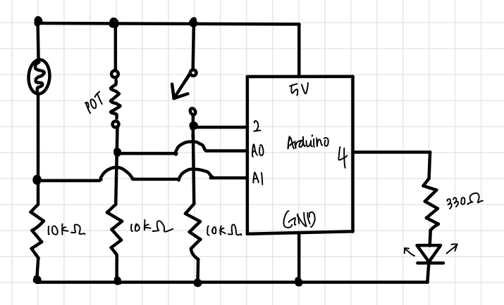
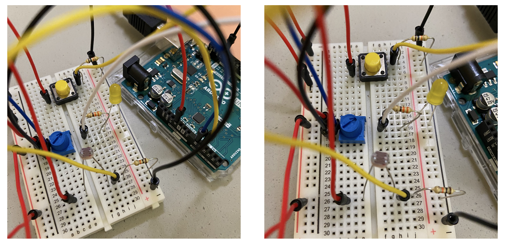

# Arduino-Processing Assignment: Ice Cream

## Description

This week, we were instructed to make a simple game that involves communication between Arduino and Processing. Because I had difficulty in understanding communication, I decided to use this assignment as a chance to understand and have a grasp of the concept of communication. Thus, I figured out the simpliest game of matching ice cream on top of cones. 

## Instruction
1. Click on the yellow switch to start the game.
2. Move the potentiometer and dial it.
3. Adjust the location of the ice cream using potentiometer and the photoresistor.
4. If the ice cream is correctly located on top of the cone, there will be a sound effect.

## Schematic 

I have attached the schematic down below. 

## Final Circuit

Below are the images for my final circuit.

## Game Demonstration  

[![Click]]()

## Demo GIF  

GIF File 1: screen recording

GIF File 2: recording of my action

## Challenge & Process

As I had imagined, the communication between the Arduino and Processing was very difficult for me. I mainly think that not using Processing for the last few weeks totally had some influence. 

### Drawing the images

I first started with making the illustrations for ice cream and cone.
I have attached the two files down below.

### Evaluation

Next time, I wish to have a more concrete idea of communication between Arduino and Processing. Then, I want to upgrade this assignment into a better game-like game, similar to the one I have made for my midTerm project. 
