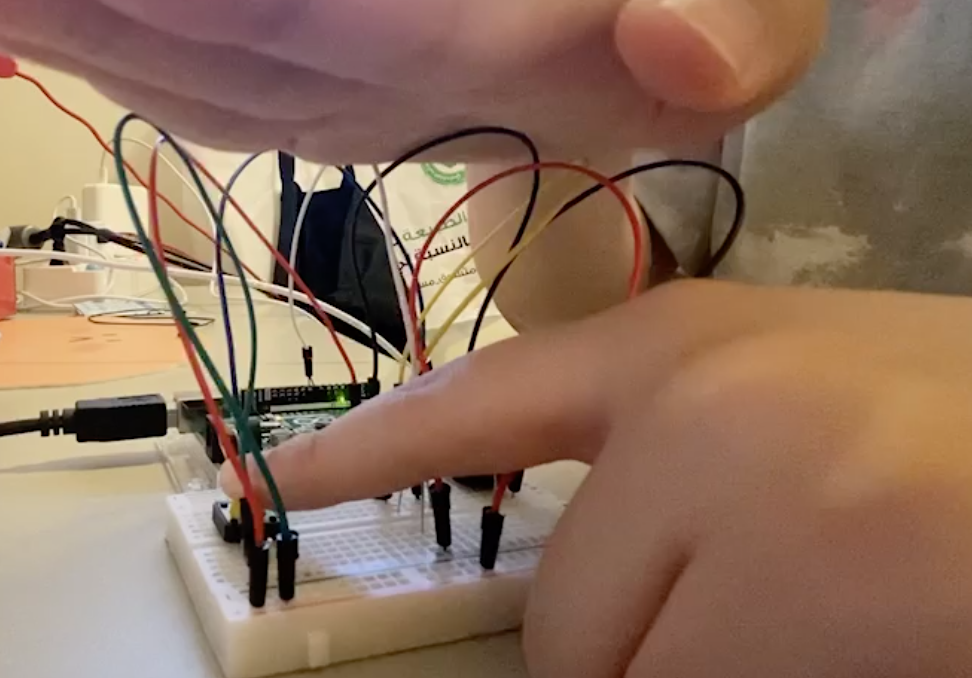
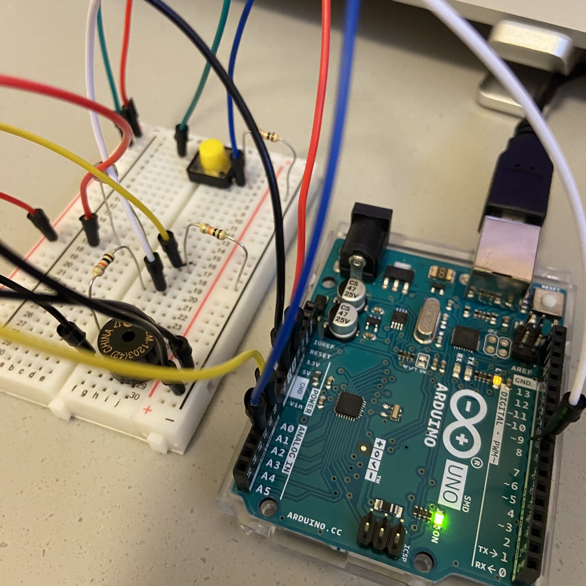
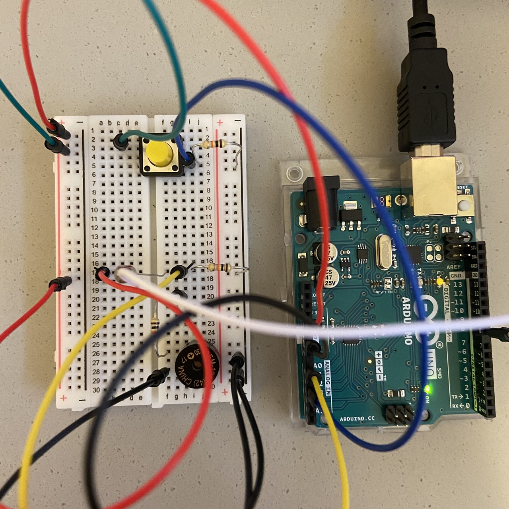
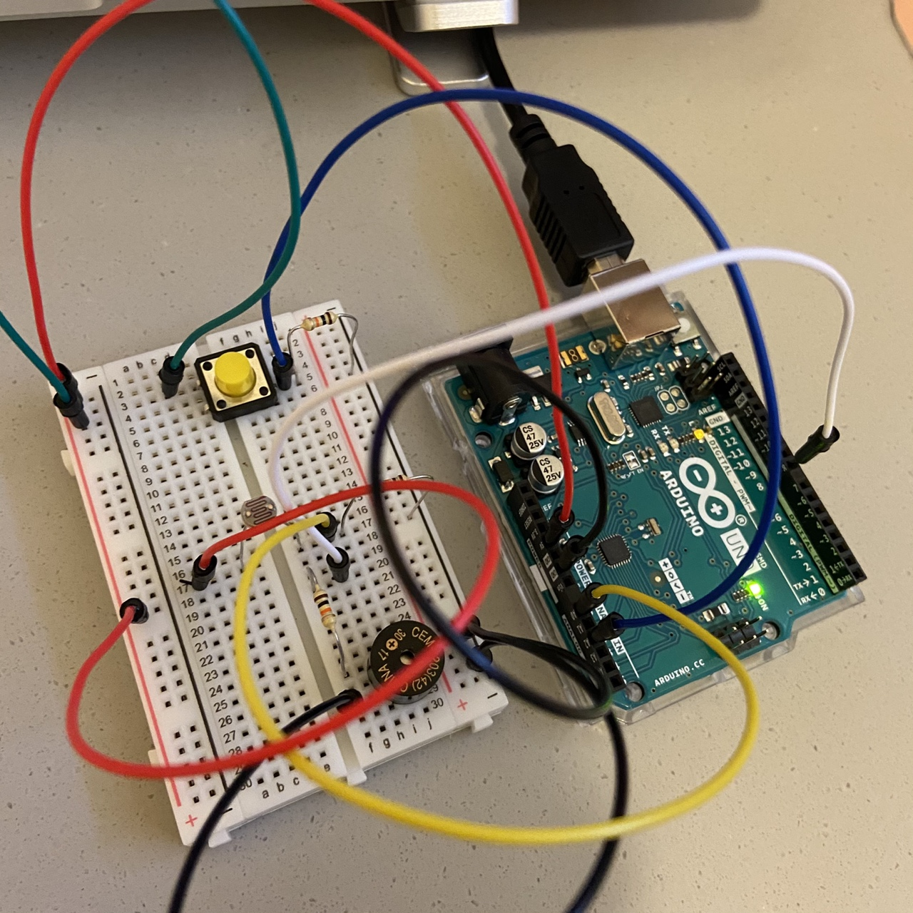

# Arduino Assignment: Make your Instrument 

## Description 
For this week, we were told to make a music instrument using both digital and analog sensors. Thus, I made an instrument that uses the piezo buzzer as the actuator.  

**Digital**
I used the momentary yellow Switch as the digital input sensor. If the user presses the button, the music will play. In order to create the sound, the player must constantly press the switch. 

**Analog**
I used the photoresistor as the analog input. The player can create higher pitches by moving one's hand closer to the photoresistor (blocking out more light), and lower the pitches by moving further away. 

## Schematic
Below is the schematic for the project:

### How to:
**Components: **

Photoresistor,Yellow momentary switch, and Piezo Buzzer (Speaker)

**Instructions: **

1. Press the Yellow Button to start playing the instrument.
2. Move closer to the photoresistor for higher pitches
3. Move away from the photoresistor for lower pitches

## Demonstration 

Click on the Image to watch me play "Mary Had a Little Lamb" song for demo!

]()

## Circuit

## Challenges & What I learned 

### Coming up with an idea

Because I could not attend class last week due to condition difficulties, I had some difficulties with following the tune function even after watching the recordings. Thus, I used some youtube videos as my reference for better understanding. 

**Useful sources: **

- https://youtu.be/J8XNTHETgxU
- http://samsneatprojectblogcode.blogspot.com/2016/06/arduino-instrument-code-and-fritzing.html
- https://www.arduino.cc/en/Tutorial/BuiltInExamples/toneMelody

I decided to give a twist of the aforementioned source (How to make an Instrument). My twist was to 1) use the photoresistor instead of the sonar sensor and 2) use the yellow switch instead of the force sensitive resistor.

### In the Future assignments, I would like to ... 

I found it very fascinating to use the sonar sensor, but I was unsure of the directions of using it.
Thus, next time, I wish to make a project utilizing the sonar sensor. 
