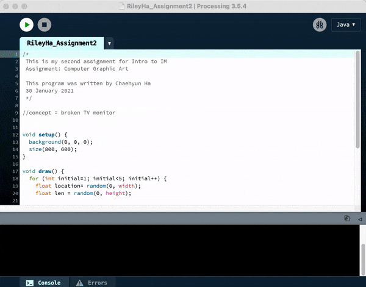
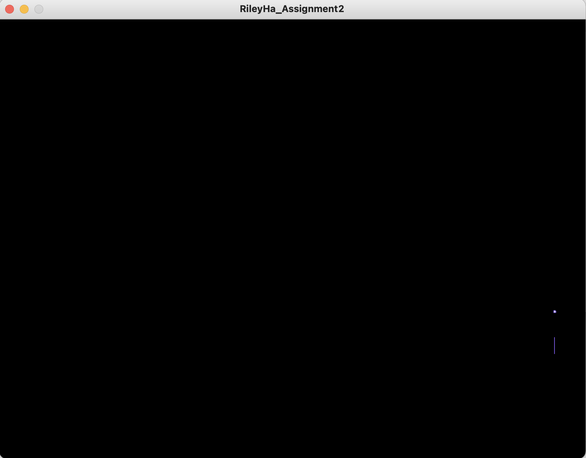
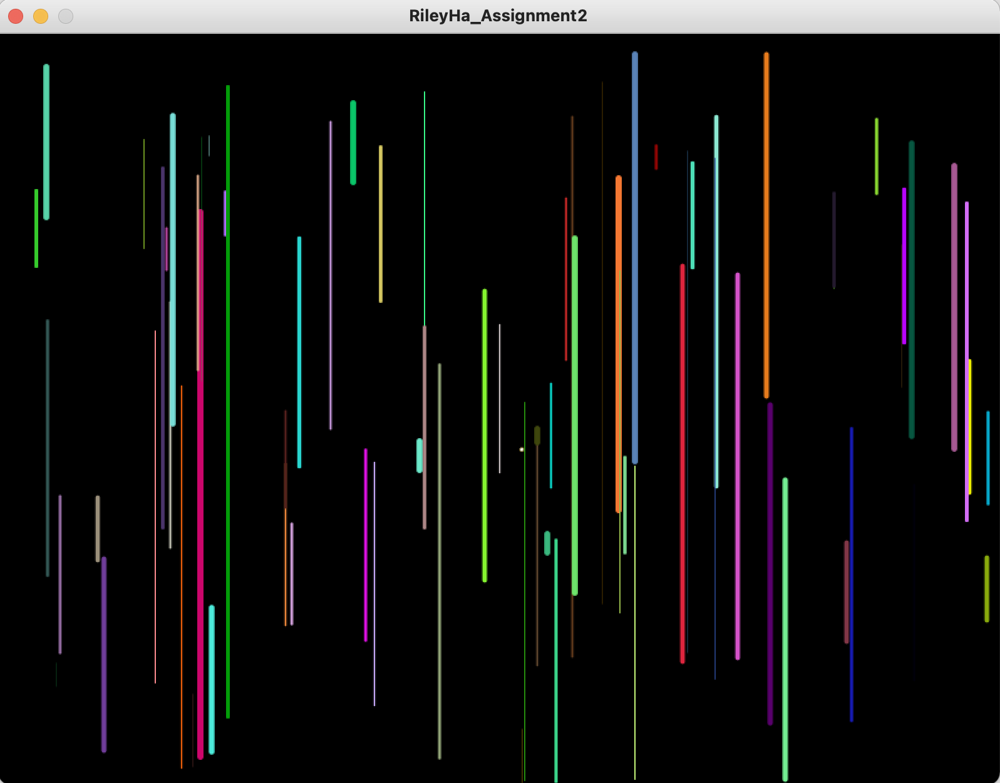
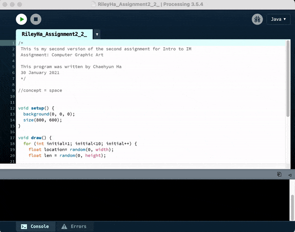
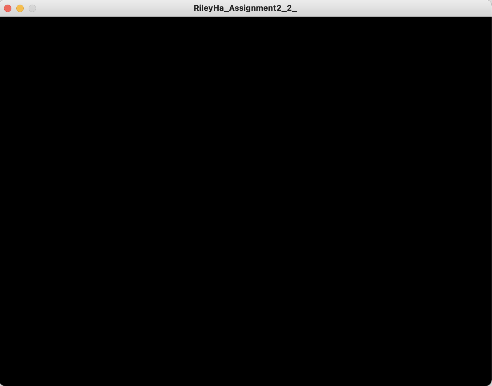
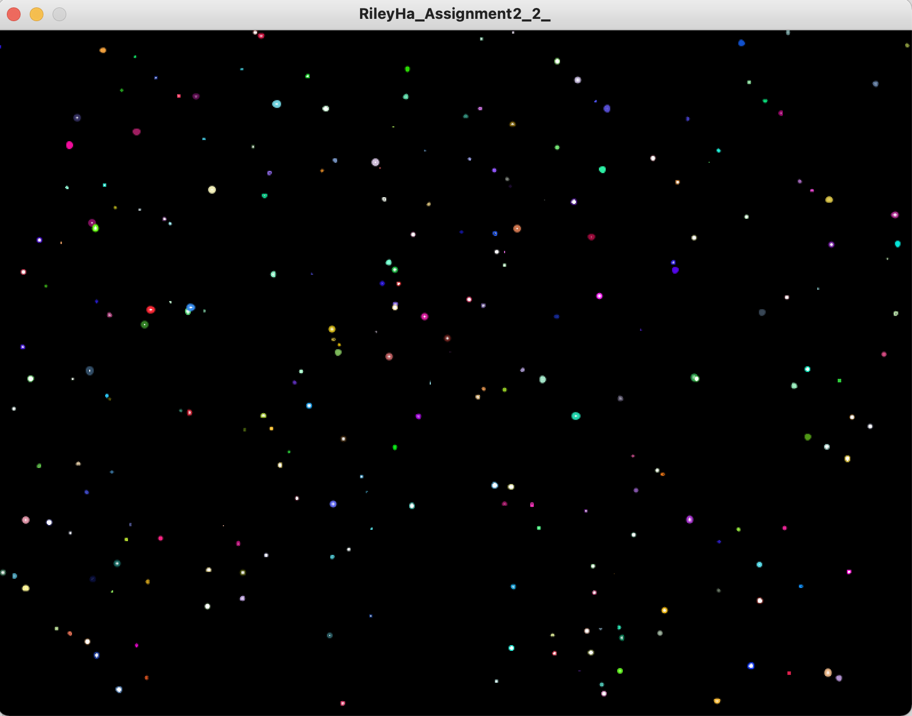

# Assignment 2: Computer Graphic Arts 

## Project Description
In this project, we had to make a simple work of art using for loops or while loops. For me, I focused on for loops because they were easier to draw the shapes as I intended them to be. While thinking about the rough draft, I came up with two major ideas for the artwork, and wanted to create an interactive art where the screen changes as the user does some action (mouseClicked). 

**First Version:**

Below is the animation that shows my first version of interactive graphic art:

- The concept of this version is broken TV screen. 
- Some lines and dots will randomly appear like this: 

- When the user takes an action of clicking the mouse, the screen will display lines with randomized color, length, and thickness.

**Second Version:**

This is the animation that shows my second version:

- The concept of this version is space and galaxy. 
- The blank page with black background will appear:

- When the user takes an action of clicking the mouse, the screen will display dots (circles) with randomized color and size.

## Process
1) Working on the rough draft
- I had to think of an motif. My motivations came while stargazing.
2) Creating the display
- I wanted the screen to be relatively large, so I set the screen to 600 X 800.
- The background color of both versions were black.
3) Working on codes
- I used for loops for both versions.
- The if / else statements inside the for loops made me able to display different screens depending on the user's input.
- I applied the shapes that we have learned in the previous lessons (circle, line).

## Challenges
- Figuring out how to create random lines 
- Computational drawing 
