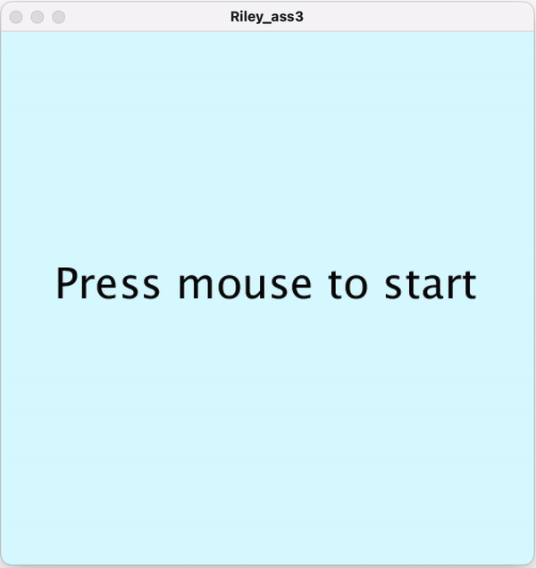

# Assignment 3: Making a game with Object Oriented Programming 

## Project Description
In this project, we had to make a simple game or artwork using object oriented programming (OOP). For me, I focused on games because they are a bit more challenging, but looks fun! However, I couldn't really come up with an idea until I thought of a brick-breaking game. Because we had learned about bouncing balls, I thought that it would be fun to apply the balls into a game.

**Demo**

Below is the animation that shows how my game turned out:



## Process
1) Working on the rough draft
- I got my ideas while watching the videos for bouncing balls. Brick breaking game is one of the most popular classic game even until now. Thus, I thought it would be nice to create the game for myself, but in a slightly different way. I found the last step of the brick breaking game most difficult; when there is only one brick left. Thus, giving a little twist, I decided to display only one brick. 
2) Creating the display
- I planned out in 5 steps:
  - Creating the Ball class (classBall)
  - creating the Bar class (classBar)
  - creating the Target class (classTarget)
  - working on the details (score)
  - Start page, end page
3) Working on codes

- classBall
  - displaying a ball: not difficult, because we had learned this in class!
  - making the ball move in random directions when it hits the wall
  
```
class ball {

  int x, y, r;
  color c;

  ball(int x, int y, int r, color c) {
    this.x = x;
    this.y = y;
    this.r = r;
    this.c = c;
  }

  void ball_move(int x, int y) {
    this.x += x;
    this.y += y;
    ball_draw();
  }

  void ball_draw() {
    strokeWeight(1);
    fill(c);
    ellipse(x, y, r, r);
  }
}
```

- classBar
  - displaying the bar: required some knowledge about the midpoint of rectangle, but still not that difficult!
  - making the X position of the bar move according to the mouse
  - making the ball move in opposite direction when it hits the bar
  
```
class bar {

  int x, y, len, wei;

  bar(int x, int y, int len, int wei) {
    this.x = x;
    this.y = y;
    this.len = len;
    this.wei = wei;
  }

  void bar_draw() {
    strokeWeight(wei);
    line(x-(len/2), y, x+(len/2), y);
  }
  
  void bar_move(int x){
    this.x = x;
    bar_draw();
  }
}
```
  
- classTarget
  - 1 block of rectangle that appears in random locations
  - making the new block appear in other random location when the ball hits the target
  
```
class target {

  int x, y;
  color c;

  target(color c) {
    this.c = c;
  }
  void target_position(int x, int y) {
    this.x =x;
    this.y = y;
  }
    void target_draw() {
      strokeWeight(1);
      fill(c);
      rect(x, y, 50, 20);
    }
}
```
  
- Score
  - increasing the score by 1 when it successfully hits the target
```
if ((myTarget.x <= myBall.x+16)&&(myTarget.x+50 >= myBall.x+16)&&(myTarget.y <= myBall.y)&&(myTarget.y +20 >= myBall.x)) {
    target_f=0;
    x_dir *= -1;
    score+=1;
  }

  if ((myTarget.x <= myBall.x - 16) && (myTarget.x + 50 >= myBall.x - 16) && (myTarget.y <= myBall.y)&&(myTarget.y + 20 >= myBall.y)) {
    target_f=0;
    x_dir *= -1;
    score+=1;
  }

  if ((myTarget.x <= myBall.x)&&(myTarget.x+50 >= myBall.x)&&(myTarget.y <= myBall.y-16)&&(myTarget.y + 20 >= myBall.y-16)) {
    target_f=0;
    y_dir *= -1;
    score+=1;
  }

  if ((myTarget.x <= myBall.x)&&(myTarget.x+50 >= myBall.x)&&(myTarget.y <= myBall.y + 16)&&(myTarget.y + 20 >= myBall.y + 16)) {
    target_f=0;
    y_dir *= -1;
    score+=1;
  }
  
  textSize(30);
  fill(#5F5DFF);
  text(score, 20, 50);
  myTarget.target_draw();
}
```
  
- Start / Endpage
  - using boolean, the user has to click the mouse to start the game
  - when the user drops the ball on the floor, the game ends
```
if(play){
    bounce_wall();
    bounce_bar();
    bounce_target();

    myBall.ball_move(3*x_dir, 4*y_dir);
    myBar.bar_move(mouseX);
  }
  
  if(main){
    if(mousePressed){
      play = true;
      main = false;
      end = false;
      init_game();
    }
    textSize(40);
    fill(#080808);
    text("Press mouse to start",50,250);
  }
  
  if(end){
    if(mousePressed){
      play = false;
      main = true;
      end = false;
      delay(100);
    }
    textSize(20);
    fill(#080808);
    text("You have dropped the ball! Click to start again ",30,250);
  }
```


## Challenges
- Making the ball move in opposite direction after it hits the bar
- Making sure that the ball actually hit the target
  - using 4 if-statements!
