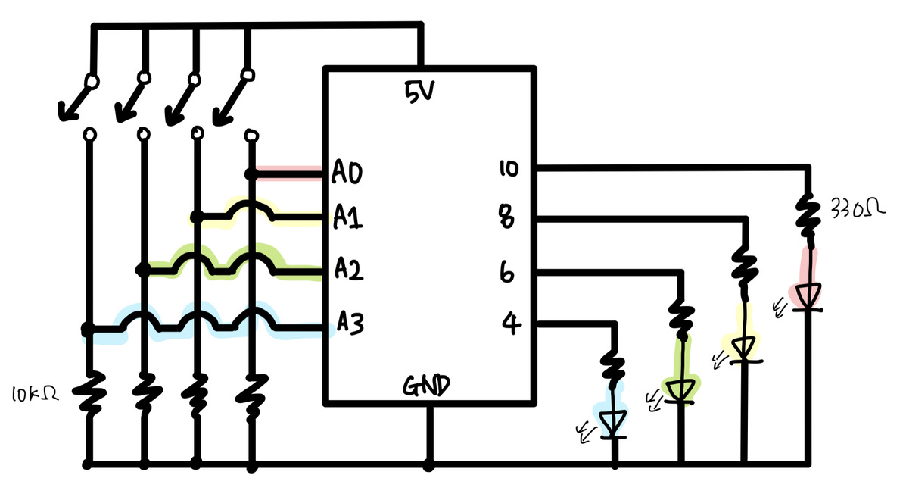
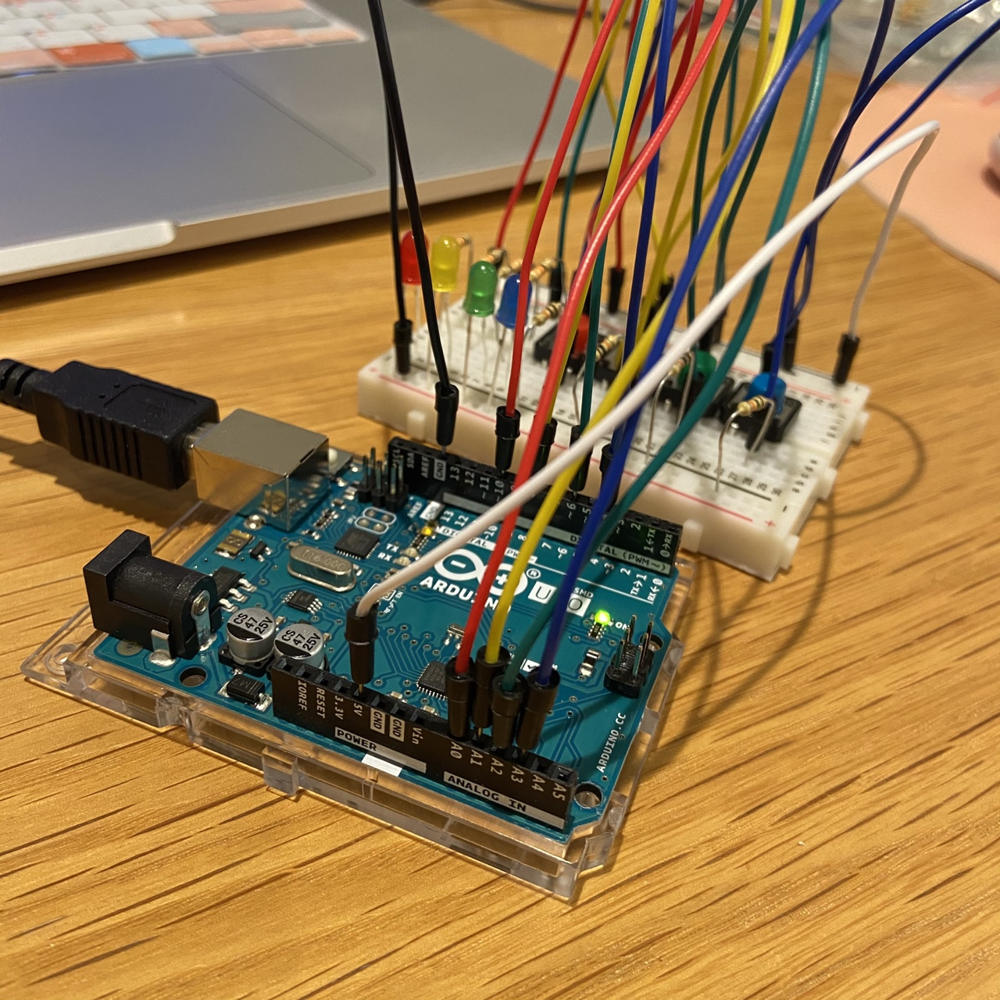
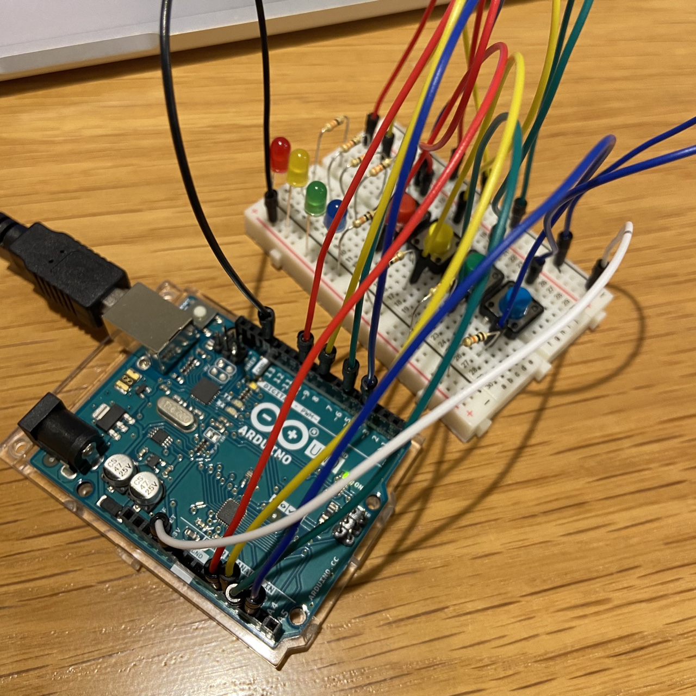
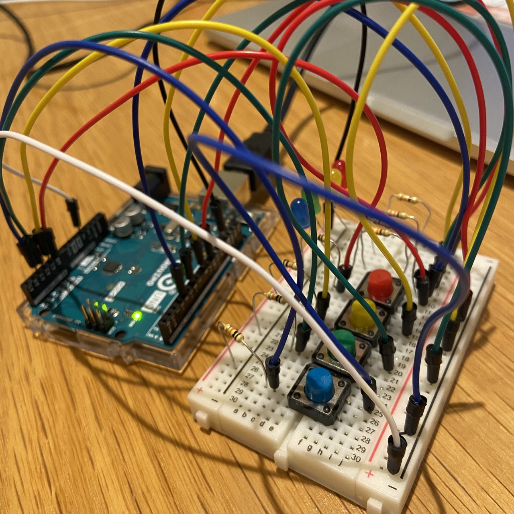
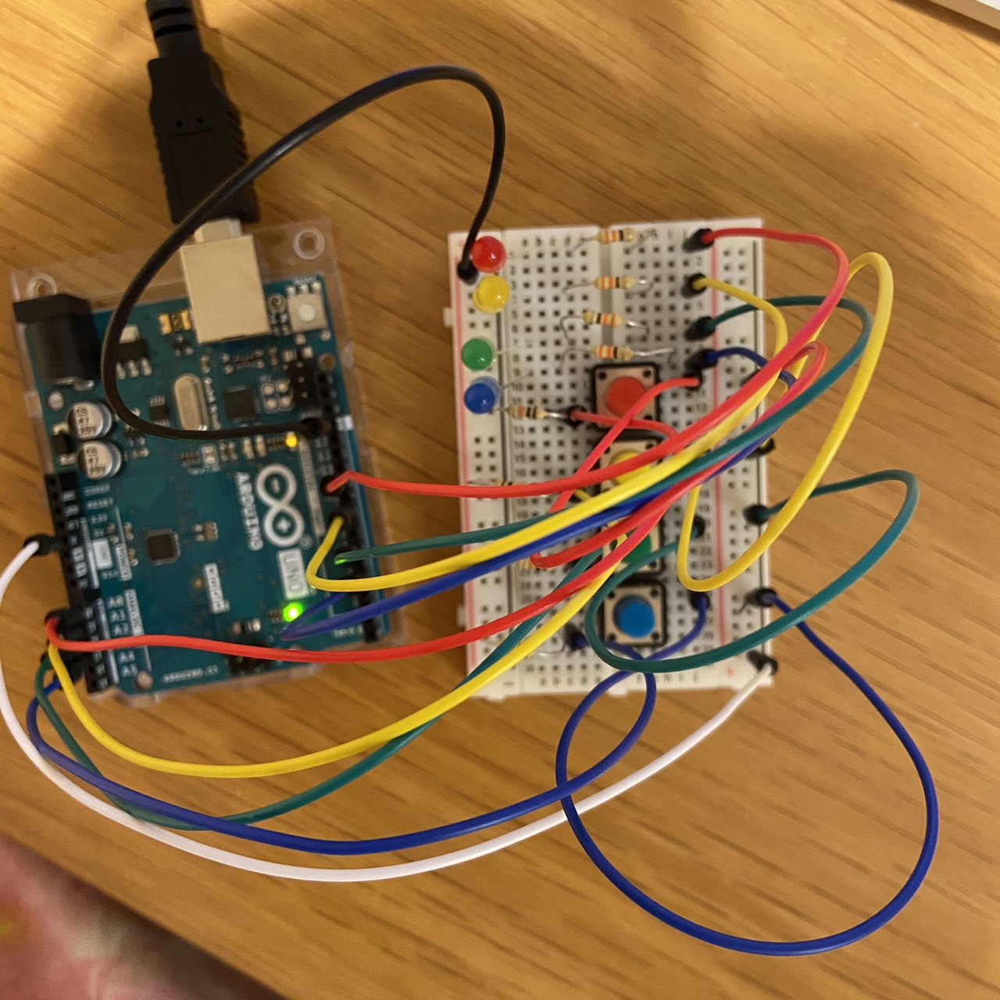

# Arduino Assignment 1 - Match the Number!

## 1. Description

We were instructed to use at least three switches and three LEDs to create a puzzle or game.
I made a game where you are given a random number and you need to press different buttons to add up and ultimately match the number. 

## 2. Ideas

I got this idea from a Korean game in which you have to match the assigned random number by adding different numbers (pressing buttons in this case). 

## 3. How to Play

As you can infer from the schematic attached below, I have 4 LEDs and 4 Switches. 

I assigned different numbers to different switches.
- Red = 1
- Yellow = 2
- Green = 5
- Blue = 10

The player gets a random number (target) from 1 to 30.

The goal is to add up to the number by pressing the switches.

For example, consider my random number as 17.

Then I would have various choices such as:
- Pressing Blue (10) - Green (5) - Yellow (2)
- Pressing Green (5) - Green (5) - Green (5) - Yellow (2)
- Pressing Red 17 times
- And so on.

If the player gets the correct random number, all of the lights will turn on for split seconds and then turn off.

## 4. Schematic & Photos

### Schematic

Following is the Schematic:

### Photos

These are the real photos:

## 4. Challenges

### Bent Switch leg
One side of the switch's legs were bent while plugging it in. Fortunately, they were not broken. 

### Target number (random functions)
I first used random() function with int value just like we learned in Java.
However, it didn't work, so I searched https://www.arduino.cc/reference/en/ for source on random function.
I found out that they are usually titled as 'long' not 'int'.

### Switch LED turn on/off
The light was on after pressing the switch, but it first would not turn off after pressing once more.
Then I realized that the switch needed two different functions of digitalWrite(LEDcolor, HIGH) and digitalWrite(LEDcolor, LOW) in one function so that the LED only turns on for a split second when the user presses the according switch.

## 5. What I Learned

### New functions (That were not familiar)
- digitalRead()
- digitalWrite()
- pinMode()

### Words
- OUTPUT
- INPUT
- HIGH
- LOW
