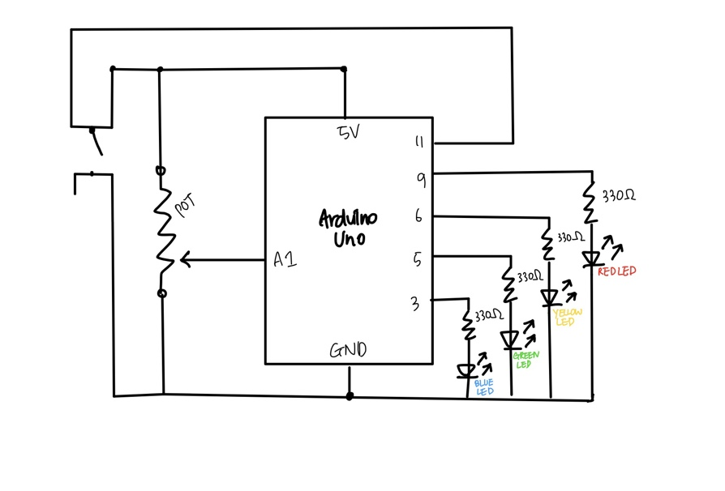
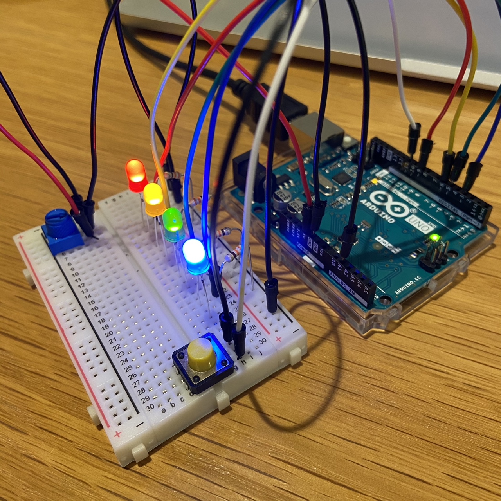
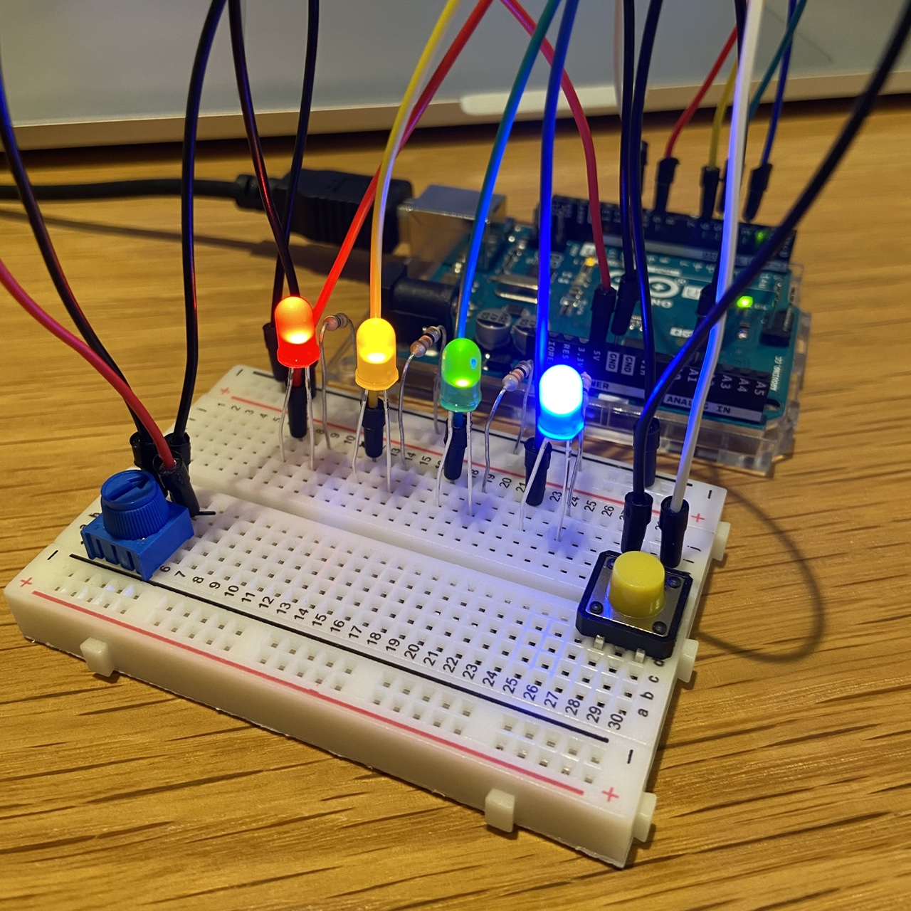
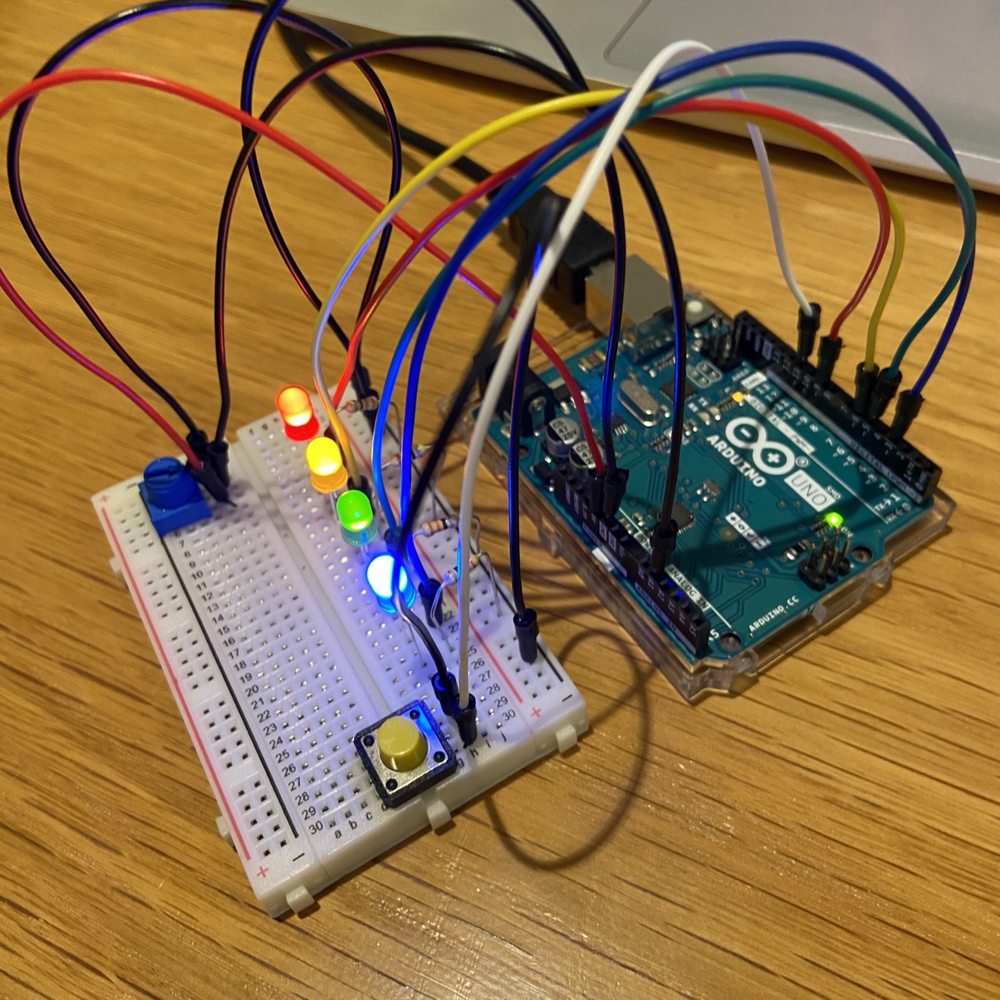
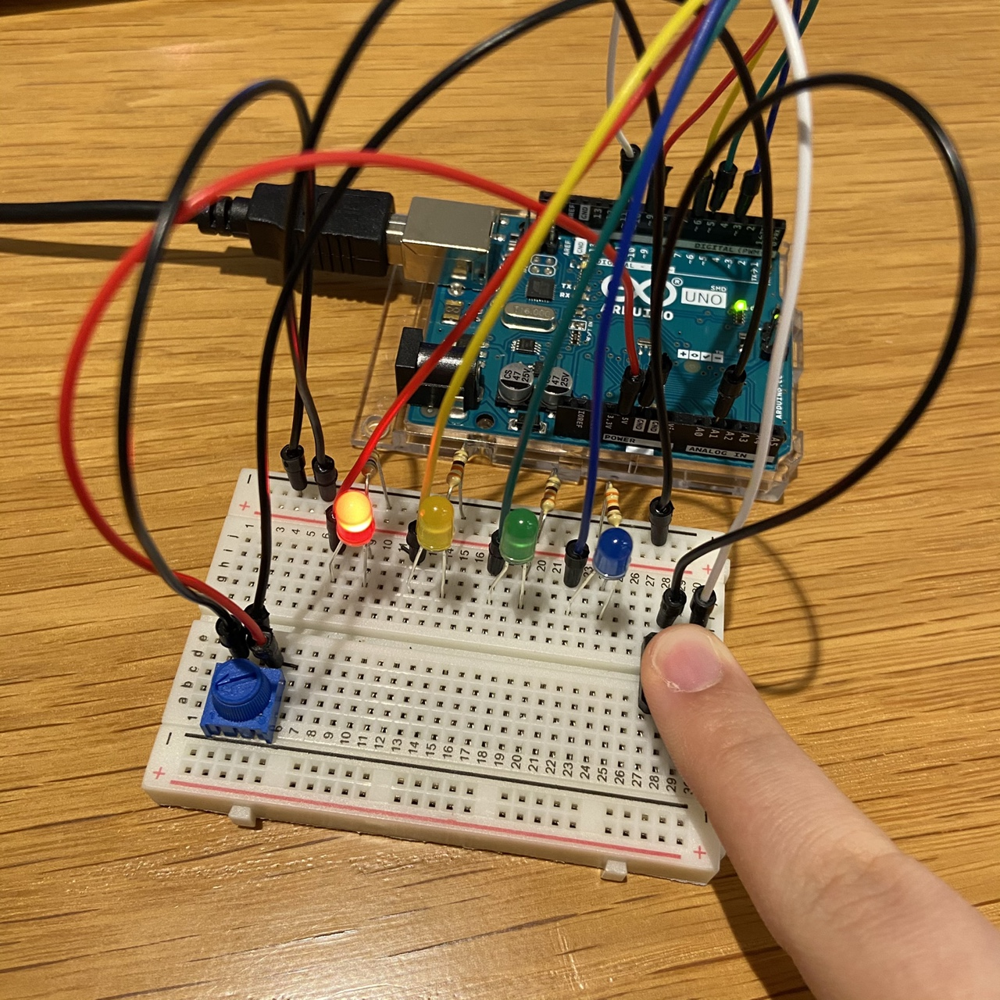
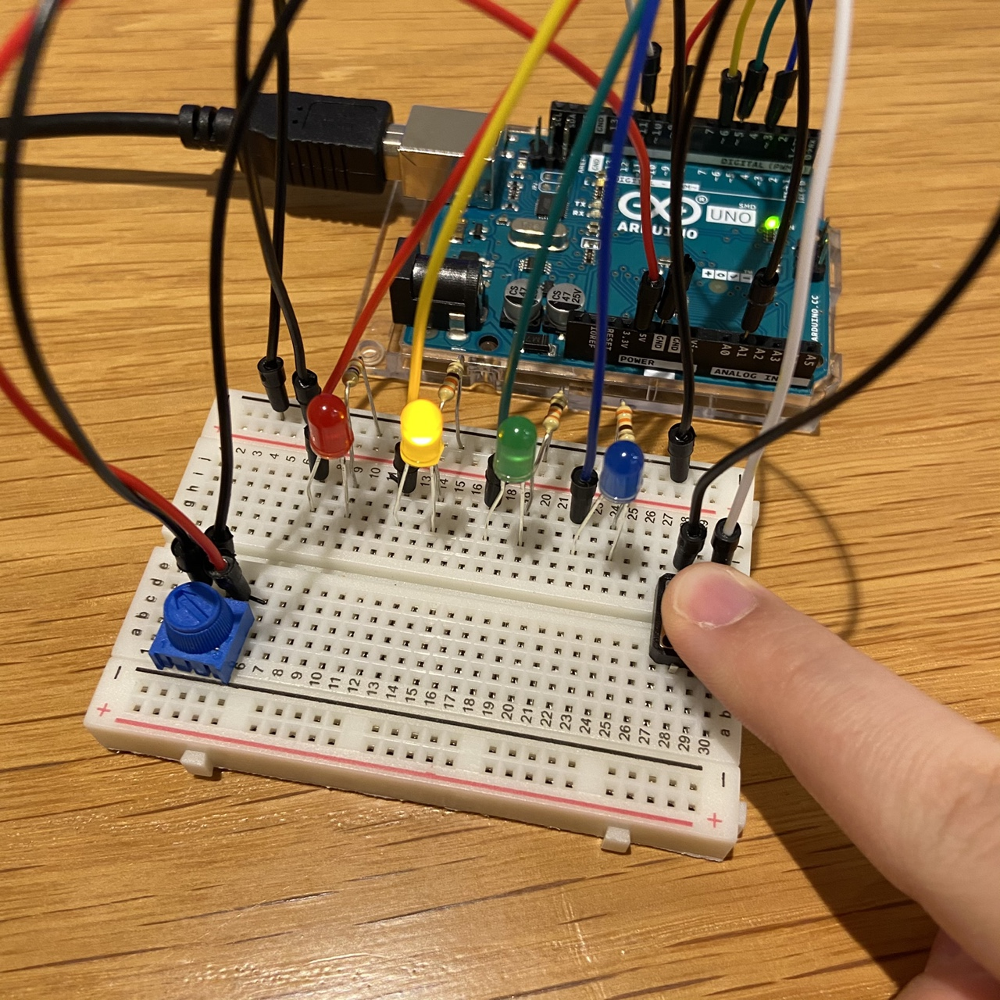
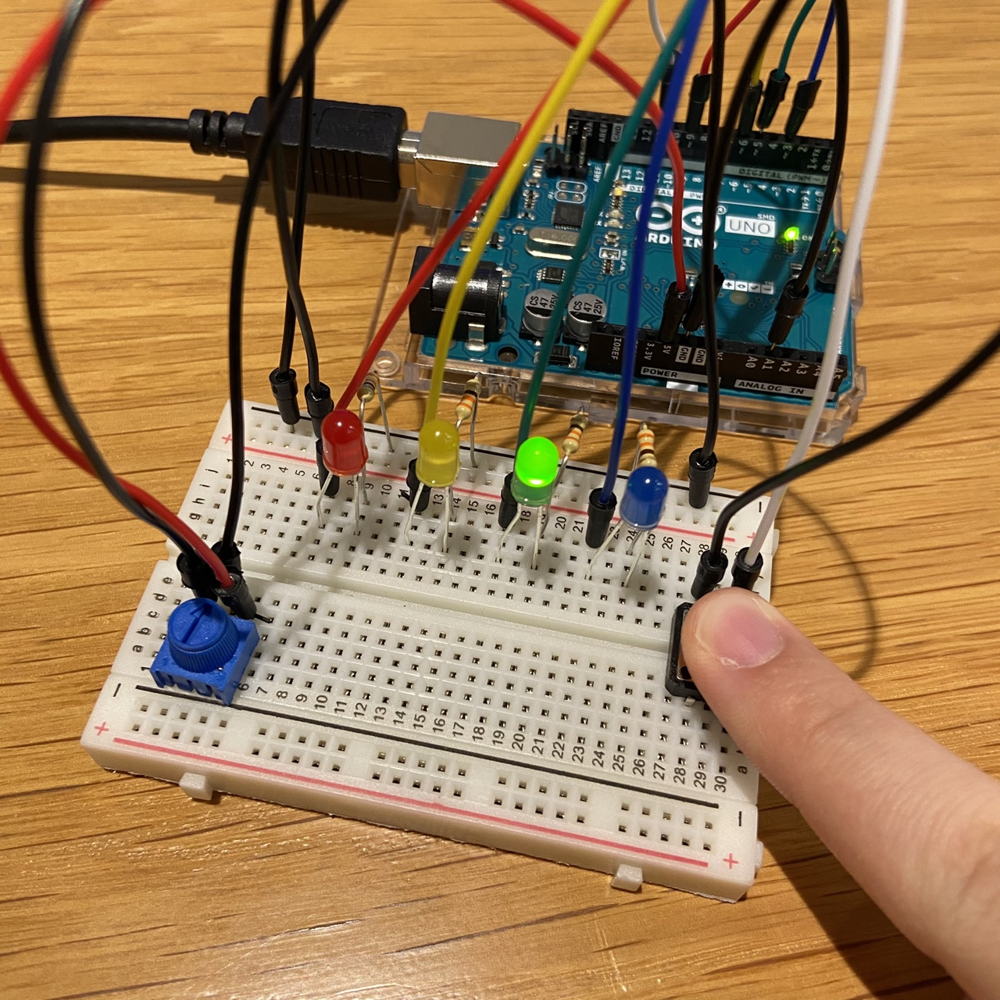
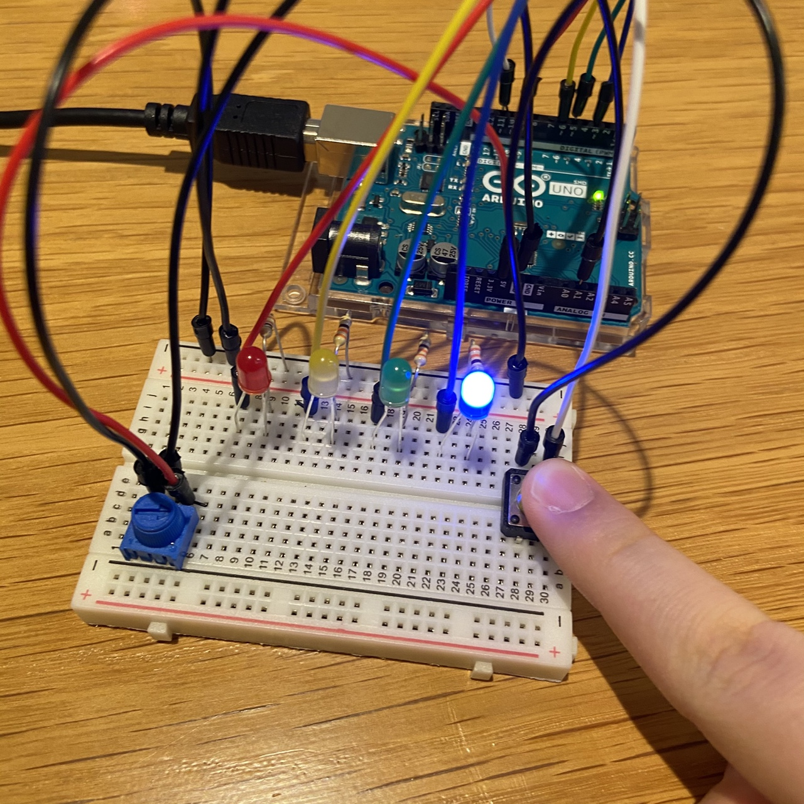
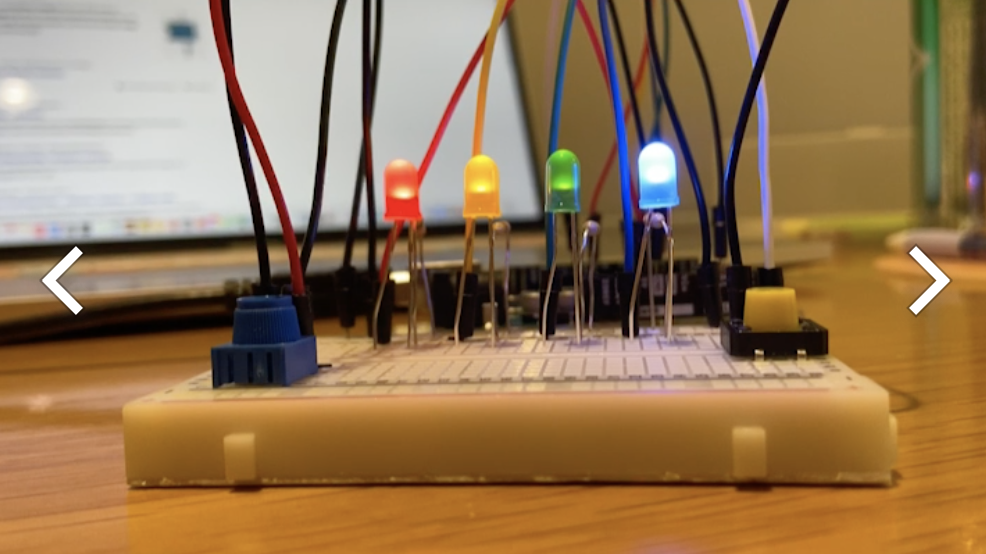
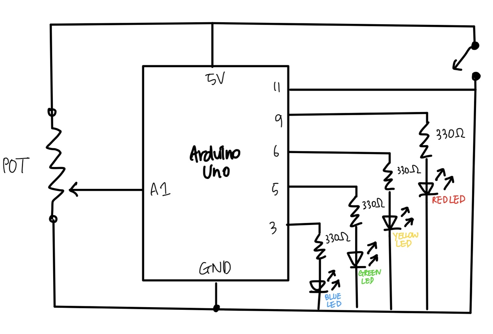

# Arduino #2 : Analog VS. Digital

## Description 
For today's assignment, we were told to create an arduino project that gets information from at least one analog sensor and at least one digital sensor (switch), and use this information to control at least two LEDs, one in a digital fashion and the other in an analog fashion.
Thus, I created a project where two people can play a light guessing game.

**How I got my idea**

It was hard for me to think of an idea considering a project that implements both analog and digital fashion.
I got my idea from number guessing game in which one person thinks of a random number and the other person has to guess the number.

## How to play
1) Start the program.
2) One person has to hide the potentiometer so that the other person cannot see.
3) All of the four lights will turn on.
4) One person (presenter), without letting the player see, adjusts (dials) the potentiometer in random direction.
5) The player has to guess which of the four light will be on once the switch is pressed. 
6) Keep in mind that the switch turns off all the lights except for one within the value range.

## Where did I use Analog and Digital fashion?
- Analog
  - Potentiometer : creates differences in value and helps display four different light (R,Y,G,B) according to the value.
  - analogRead
- Digital
  - Turning off all LEDs at once with a switch
  - digitalRead
    
    
## Schematic
Below is the schematic for the project:



## Images of the circuit




## Images for instruction
Start (Right after running the program):


Red LED:


Yellow LED:


Green LED:


Blue LED:



## Final Game Demo

[](https://youtu.be/TWAe34TOLVE)
Click on the image to watch the video demo

## Challenge & Interesting Ideas 

### Coming up with an idea
As mentioned before, it was difficult for me to think of a project that utilizes both analog and digital fashion.

### Schematic
It was hard to draw the schematic because there were both potentiometer and a switch.
Then, I remembered that all of the inputs should be drawn at the left, and all of the outputs should be drawn at the right.
I had to google some images for reference.

Following was the schematic that I drew before remembering the input and output rule:



### Potentiometer Value Range!
I had to know the value range of the potentiometer to give different ranges for the four LEDs.
Thus, I came to realize that the potentiometer changes the resistance.

"Arduino has an analogRead range from 0 to 1023, and an analogWrite range only from 0 to 255, therefore the data from the potentiometer needs to be converted to fit into the smaller range before using it to dim the LED."
- https://www.arduino.cc/en/tutorial/potentiometer

Professor told us the easier way to figure out!
```
int sensorvalue = analogRead(potPin);
int whichLED = map(sensorValue, 0, 1023, 1, 4);
```

### Prioritizing
A simple change in the location of the code may result in huge difference!
