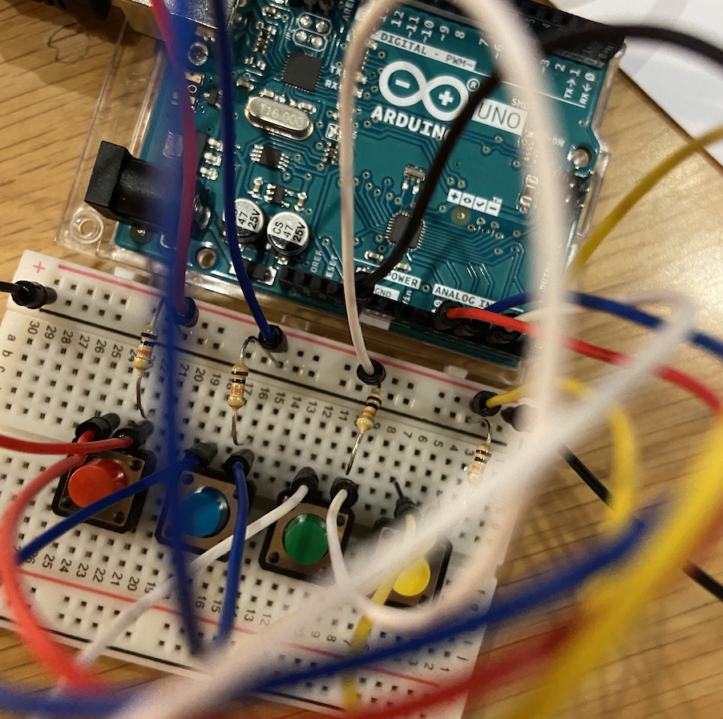

# Riley Ha Intro to IM Final Project

# Trivia game for High School Musical Fans (or soon to be Fans)

## Ideation & Description

For my final project, I decided to do a trivia game for High School Musical (HSM for short). I have always been obsessed with HSM since my childhood, and it has always been my comfort show. I decided to implement a quiz game like format, but only using arduino in terms of switches (buttons) for selecting the check boxes. 
The game is not only for High School Musical fans, but also for those who do not know HSM at all. For them, this game will provide a chance to take the personality test.

**How to Play**

The following instruction will appear as the user clicks the 'how to play' button. 

1. Each switch on the breadboard corresponds to the choices on the processing screen.
2. Read the questions carefully.
3. Make your decision on which to choose.
4. Press on the corresponding button to choose your answer.
5. Answer all 11 questions to know which character of HSM you are!

It is not a competitive game, it is just a relaxing game 100% based on my desire to advertise HSM :)). 

## Process

### Classes
For this project, I used 5 classes - startPage, howTo, endPage, Score, and Switch.
The description of the classes are further explained in my journal.

### Schematic 

Below is the schematic for the project.

## Circuit

Below is the photo of the final circuit.

## Game Demonstration  

Click to see the demonstration video. 

## Challenges

### Using StringList and IntList

As mentioned in the journal, I had a hard time coming up with a solution for shuffling the answers in a random order, but keeping the orders for the questions. 
I initially thought of arrays, but since I was more used to list, I decided to go for list. Because list allows only one type, it was easy for me to distinguish string list and int list, each separately used for the answer choices and the scores. 

### Processing & Arduino Communication

Why can I never be used to this processing and arduino communication :(
It seems like I struggle every time. I think I should work on this more. 

## Checkpoint

- A description of your concept and how it was achieved
- A picture of your circuit schematic
- One or more photographs of your project
- Major problems, if any, and solutions, if any
- Clever or difficult things about your project
- A link to the video
