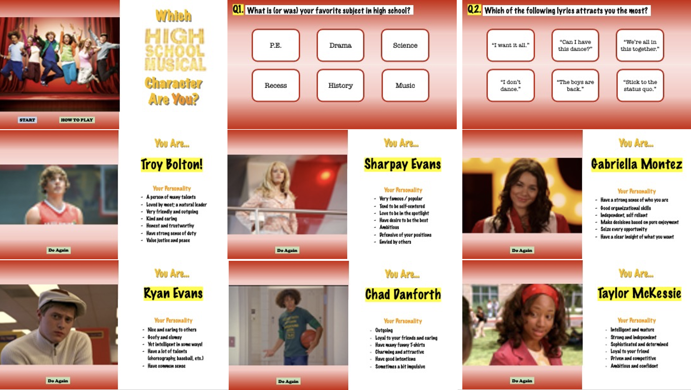

# Riley Ha Final Project Journal

## 14 April 2021

### Coming up with idea

I had two ideas in mind.
1) Trivia game for High School Musical (HSM for short)
2) Arcade game (Something like Flappy Bird, Pac-Man, or T-Rex game)

However, since I wanted to do something meaningful and unique to me, I decided to go for the first idea - Trivia for HSM Fans! 

High School Musical is my comfort movie (I am sure that I watched the whole series more than 30 times). Thus, I decided to go with the topic - "Which High School Musical Character Are You?" This idea was based not only on my interest but also my desire to advertise this wonderful movie to everyone.

This is not a game in which you compete with others to earn points; it is rather a game that everyone (from HSM manias to those who does not know about the movie at all) can relax and enjoy. 

## 15 April 2021

Today, I wrote down few tasks/challenges that must be solved. In other words, they will be the process of the whole project.

### Tasks / Challenges

1. How will the starting page look? 
2. Instruction page?
3. Questions for the players?
4. Communications between Arduino and Processing?
5. How can I inform the player about their selection (choice)?
6. Final page that tells the player who their character is
7. Replay?

### Blueprint

I briefly designed the blueprint of how my trivia will look like. 
I used PowerPoint. 

## 16 April 2021

### Coming up with questions for the Trivia

Today I thought of 11 questions related to each main characters of HSM. I first thought that 10 questions would be enough, but I found out that there might be times when a tie happens. Thus, I decided to make the questions an odd number so that a tie does not happen.

There are 6 main characters in HSM (Ryan, Sharpay, Troy, Gabriella, Chad, Taylor in order)
It was quite difficult to come up with questions unique to each characters - even if I watched them for over 10 years!

**References:**

[Seventeen.com](https://www.seventeen.com/celebrity/celeb-quizzes/a27294/hsm-character-quiz/)

[Buzzfeed 1](https://www.buzzfeed.com/ehisosifo1/high-school-musical-character-quiz)

[Buzzfeed 2](https://www.buzzfeed.com/squozz357/which-high-school-musical-character-are-you-1bs04bwadc)

## 17 April 2021

### Starting Arduino part of code
