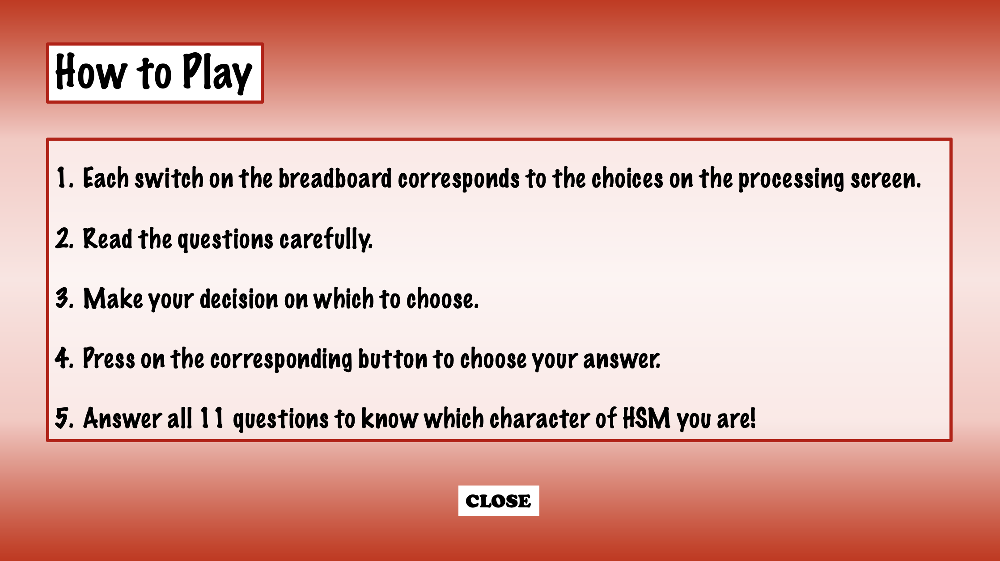

# Riley Ha Final Project Journal

## 17 April 2021

### Coming up with idea

I had two ideas in mind.
1) Trivia game for High School Musical (HSM for short)
2) Arcade game (Something like Flappy Bird, Pac-Man, or T-Rex game)

However, since I wanted to do something meaningful and unique to me, I decided to go for the first idea - Trivia for HSM Fans! 


High School Musical is my comfort movie (I am sure that I watched the whole series more than 30 times). Thus, I decided to go with the topic - "Which High School Musical Character Are You?" This idea was based not only on my interest but also my desire to advertise this wonderful movie to everyone.


This is not a game in which you compete with others to earn points; it is rather a game that everyone (from HSM manias to those who does not know about the movie at all) can relax and enjoy. 

## 19 April 2021

Today, I wrote down few tasks/challenges that must be solved. In other words, they will be the process of the whole project.

### Tasks / Challenges

1. How will the starting page look? 
2. Instruction page?
3. Questions for the players?
4. Communications between Arduino and Processing?
5. How can I inform the player about their selection (choice)?
6. Final page that tells the player who their character is
7. Replay?

### Blueprint

I briefly designed the blueprint of how my trivia will look like. 


### Starting Page & HowTo Page

Like the previous midTerm project, I decided to use PImage as the background and use the mouseClicked() function.
Thus, I created background images for Starting page, How To (instruction) page, and the result pages for every 6 characters.





## 21 April 2021

### Coming up with questions for the Trivia

Today I thought of 11 questions related to each main characters of HSM. I first thought that 10 questions would be enough, but I found out that there might be times when a tie happens. Thus, I decided to make the questions an odd number so that a tie does not happen.


There are 6 main characters in HSM (Ryan, Sharpay, Troy, Gabriella, Chad, Taylor in order)
It was quite difficult to come up with questions unique to each characters - even if I watched them for over 10 years!

**References:**

[Seventeen.com](https://www.seventeen.com/celebrity/celeb-quizzes/a27294/hsm-character-quiz/)

[Buzzfeed 1](https://www.buzzfeed.com/ehisosifo1/high-school-musical-character-quiz)

[Buzzfeed 2](https://www.buzzfeed.com/squozz357/which-high-school-musical-character-are-you-1bs04bwadc)

```
String question1 = "What is (or was) your favorite subject in high school?";
String question2 = "Which of the following lyrics attracts you the most?";
String question3 = "If you had to work during summer, which job would you pick?";
String question4 = "What is your biggest fear?";
String question5 = "Which university attracts you the most?";
String question6 = "Which do you consider as your biggest flaw?";
String question7 = "Secret hobby that your friends will be most surprised at";
String question8 = "How would your friends describe you?";
String question9 = "What is your favorite musical instrument?";
String question10 = "What would cause you to end up in detention?";
String question11 = "What is most important to you right now?";

String[] troy = {"P.E.", "We're all in this together", "Private trainor", "Disappointing your parents", "U.C.Berkeley", "You are insecure", "Musical", "Selfless", "Guitar", "Being late", "My lover"};
String[] gabriella = {"Science", "Can I have this dance?", "Lifeguard at pool", "Showing your real emotions", "Stanford", "You are indecisive", "Dancing", "Independent", "Tambourine", "Talking back to a teacher", "My future career"};
String[] sharpay = {"Drama", "I want it all", "No thanks, I'm already rich", "Being alone", "University of Albuquerque", "You are self-centered", "Scholastic Decathlon", "Popular", "My voice", "Horrible grades", "Gaining popularity"};
String[] ryan = {"Music", "I don't dance", "Talent show organizer", "Being disliked", "Juilliard", "You are clumsy", "Yoga", "Goofy", "Piano", "Talking too much in class", "YOLO"};
String[] taylor = {"History", "Stick to the status quo", "Activity coordinator", "Being judged by others", "Yale", "You have the urge to always be right", "Baking", "Smart", "Castanets", "Getting into a fight", "Power and authority"};
String[] chad = {"Recess", "The boys are back", "Helping in the kitchen", "People changing for the worse", "I don't want to go to a uni", "You are stubborn", "Reading books", "Caring", "I hate music", "Skipping school", "Sports"};

```


## 22 April 2021

### Starting Arduino part of code

**Challenge**
I was drawing the schematic of the arduino, but Boom, I realized that there are only 4 switches. Thus, I decided to implement a code that is available with only 4 switches that work as 6 switches. It was hard for me to think of the solution, but I figured out that double-clicking might work.
I placed 4 switches that correspond to the first 4 choice boxes, and I had to figure out a code that allowed me to read the double click. However, this would just make the pages move on to the next one.

Hence, I had to come up with a new solution. This time, I thought of a way that reads pressing for a long time.

## 24 April 2021

### Starting Processing part of code

I devised 5 classes for the code - Score, Switch, endPage, howTo, and startPage.
- As their name suggests, score class is for reading the input of the user's choice and counting the scores for each 6 characters. The character with the highest score will appear as the user's final HSM character.
- Switch class is for creating the choice boxes in which the choices will appear. 
- endPage class is literally the ending page in which one HSM character that correspond to the user's selection will appear.
- howTo class is where the player can view the instruction.
- startPage is the starting page

```
public class startPage {
  void display() {
    if (isStartPage) {      
      image(Start, 0, 0, 1117, 628);
    }
  }

  void displayStart() {

    if ((mouseX > 94 && mouseX < 184) && (mouseY > 550 && mouseY < 588)) {
      erase();
      isStartPage = false;
      gameStart = true;
      page1 = true;
      gameEnd = false;
    }
    if ((mouseX> 288 && mouseX < 473) && (mouseY > 550 && mouseY < 588)) {
      erase();
      isStartPage = false;
      instruction.display();
    }
  }
}
```
```
public class howTo {

  void display() {
    image(inst, 0, 0, 1118, 628);
  }

  void displayHow() {
    if ((mouseX > 504 && mouseX < 552) && (mouseY > 535 && mouseY < 577)) {
      erase();
      isStartPage = true;
      start.display();
    }
  }
}
```
```
public class endPage {

  void displayTroy() {
    image(Troy, 0, 0, 1117, 628);
  }
  void displayGabriella() {
    image(Gabriella, 0, 0, 1117, 628);
  }
  void displaySharpay() {
    image(Sharpay, 0, 0, 1117, 628);
  }
  void displayRyan() {
    image(Ryan, 0, 0, 1117, 628);
  }
  void displayTaylor() {
    image(Taylor, 0, 0, 1117, 628);
  }
  void displayChad() {
    image(Chad, 0, 0, 1117, 628);
  }
}
```
The startpage, instruction page, and the game background image all appears! Hurray!

## 25 April 2021

### Usage of StringList and IntList

```

String[] answer1 = new String[6];
String[] answer2 = new String[6];
String[] answer3 = new String[6];
String[] answer4 = new String[6];
String[] answer5 = new String[6];
String[] answer6 = new String[6];
String[] answer7 = new String[6];
String[] answer8 = new String[6];
String[] answer9 = new String[6];
String[] answer10 = new String[6];
String[] answer11 = new String[6];

StringList[] shuffle = new StringList[11];

StringList shuffle1 = new StringList();
StringList shuffle2 = new StringList();
StringList shuffle3 = new StringList();
StringList shuffle4 = new StringList();
StringList shuffle5 = new StringList();
StringList shuffle6 = new StringList();
StringList shuffle7 = new StringList();
StringList shuffle8 = new StringList();
StringList shuffle9 = new StringList();
StringList shuffle10 = new StringList();
StringList shuffle11 = new StringList();

String[][] answers = {answer1, answer2, answer3, answer4, answer5, answer6, answer7, answer8, answer9, answer10, answer11};

IntList scoreTroy;
IntList scoreGabriella;
IntList scoreSharpay;
IntList scoreRyan;
IntList scoreTaylor;
IntList scoreChad;

IntList scoreList;

```
Although it was quite hard for me to think of ways that would allow both randomly shuffling the answers, I found out that List is helpful in this. I kind of contemplated between arrays and list.
