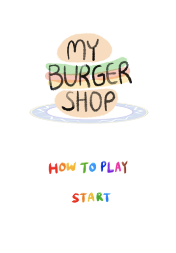
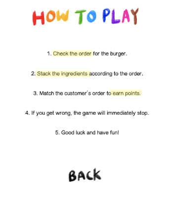
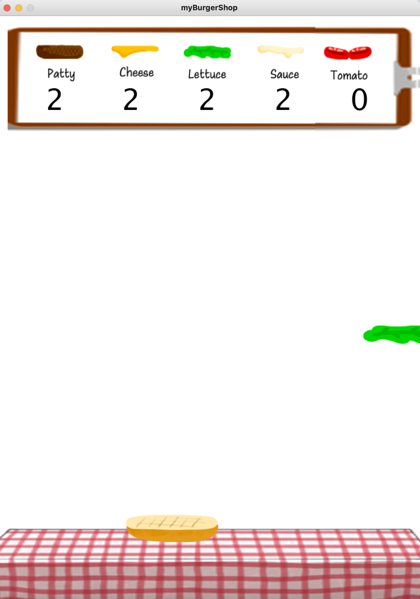
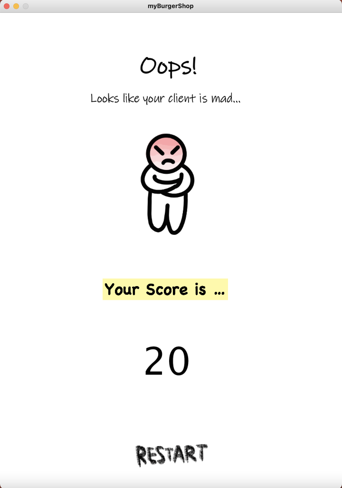

# Production Midterm: My Burger Shop

## DESCRIPTION
'**My Burger Shop**' 
is an easy and fun game that players has to catch the falling ingredients of the burger according to the customer's order displayed on the upper part of the screen. 

## How did I come up with this game?
I got the idea from 'Sky Burger'. I remember enjoying the game a lot, so I decided to give some changes and variation to my childhood game. 

## Steps

- The bottom bun moves according to the mouse
- The customer demands certain type of burger randomly (ex. 2 patties, 3 lettuce, 1 cheese, ...)
  - This will show at the top menu
- The player has to catch the falling ingredients according to the customer's demand
- If the stacked burger is same as the customer's needs, the player gains a point (10 point per burger).
- If the player gets the order wrong, the game will immediately end.

### Start page 

When players run the program, they are met with this landing page. 

   

Here, the player can either click 'How to Play' button or 'Start' button. 

### Instruction Page

When the player clicks the 'How to Play' button, this page will appear.

The player can take a look at the instruction and rule of the game. 
If the player clicks the 'BACK' button, it will lead him/her back to the starting page.

### Game Page

When the player clicks the 'Start' button, this page will appear. 
Attached below is the sample demo game page. 

### End Page

When the player gets the customer's order wrong, this end page will appear.
It will display the points that the player earned.
It also contains the 'Restart' button in which the player can restart the game.

### Reflection & Evaluation

- I actually enjoyed the whole process of making the game. I also think I learned a lot from it. 
- **There were some challenges:**
  - fall() function would leave traces of previous images: I used erase() function that refreshes the background
  - it was hard to figure out how to 'stack' the images of the ingredients
  - boolean still confuses me 😔
  - the mouseClicked() function would not work for the first time : I figured out that it should be inside a setup function
  - inserting sound files!
  - displaying randomized customer orders in text 
  

### Expectations
There are some points where I would like to enhance / further work on.
1. The player can select the level of the game; beginner (one ingredient at a time) / advanced (2+ ingredients at a time)
2. The money (score) that the player got appears on the screen
3. The remaining ingredient on the screen decreases as the player catches them
4. Add other sound or bgms

