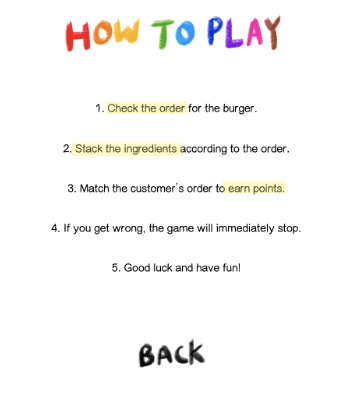

# My Burger Shop

## Journal of Progress

### Feb 23 & 24 (Brief Ideas, Brainstorming)
1. After I decided to change the game from ‘Guessing the Song by lyrics’, I needed brief ideas about brainstorming. 
2. The basic idea is similar to the game “Sky Burger”

3. However, unlike “Sky Burger” where you stack the falling ingredients as high as possible, I decided to change the game into a more dynamic version.
4. I designed the overall game steps and layouts this day. 
I will use the following demo icon of the falling ingredients.

5. I organized the classes needed for the game.
```
MAIN 
startPage // appears when the program is loaded
howTo // appears when the player clicks the 'How to Play' button
gamePage // appears when the player clicks the 'Start' button
endPage // appears when the player gets the order wrong
```

### Feb 25 (Designs, Making images, Start page)
1. I decided to use image files for the buttons that lead to the instruction page and the game to start. Following are the icon buttons.


2. I finished designing the starting page as attached below. 


3. I also finished the illustrations of the falling ingredients. (Drawn by me with Procreate)


4. I used mouseClicked() function to check if the user has clicked the buttons or not.
```
void displayStart() {
    if ((mouseX > 200 && mouseX < 520) && (mouseY > 650 && mouseY < 710)) {
      erase();
      isStartPage = false;
      howToPlay.display();
    }
    if ((mouseX> 200 && mouseX < 520) && (mouseY > 800 && mouseY < 860)) {
      erase();
      isStartPage = false;
      gameStart = true;
      gameEnd = false;
      gamePage.display();
    }
  }
  
```

### Feb 26 (How to Play, End Page, Functions)
1. I finished designing the Instructions page (that appears when the player clicks the 'How to Play' Button)



2. I also finished designing the End Page (when the player gets the customer's order wrong)


3. I organized the functions needed inside the gamePage. 
```
getOrder() // for displaying customer's orders (randomized)

pickIng() // picking random ingredient among 5 (beef, cheese, lettuce, sauce, tomato)

drawIng() // displaying ingredients on the game screen)

fall() // making the ingredient image fall down

display() // displaying the background, image of the bottom bun, stacking the burger

check() // 1) check if the ingredient has fallen out of the screen 2) check if the player got the ingredient on the bun

finishBurger() // if the player got top bun, finish the game and check if the player got it right

resetGame() // reset the game into initial

```

### Feb 26 (Working on getOrder() and pickIng() function)
1. I worked on getOrder() function and pickIng() function. I decided to make two arraylists. I chose arraylist over arrays because it is easier to get the elements and add elements. The get() and size() functions were also efficient in counting the elements and using in for loops.
2. I figured out that there are two arraylists needed; one for setting randomized customer's orders, and one for getting player's input.
3. I named the first one 'customerOrder' and the second one 'ingOnBun'
```
  void getOrder() {
    for (int i=0; i<5; i++) {
      customerOrder.add(int(random(0, 3)));
    }
  }
  
   void pickIng() {
    if (!hasIngBeenPicked) {
      hasIngBeenPicked = true;
      setup();
      fall();
      pick = int(random(0, 6));
    }
  }
```

### Feb 27 (drawIng() and fall() functions)
1. Today, I worked on displaying the ingredients on the screen. 
2. I used PImage and image function.
```
void drawIng() {
    if (pick == 0) {
      image(beef, ingX, ingY);
    } else if (pick == 1) {
      image(cheese, ingX, ingY);
    } else if (pick == 2) {
      image(lettuce, ingX, ingY);
    } else if (pick == 3) {
      image(sauce, ingX, ingY);
    } else if (pick == 4) {
      image(tomato, ingX, ingY);
    } else if (pick == 5) {
      image(topbun, ingX, ingY);
    }
  }
 
 void fall() {
    ingY = ingY + ingSpeed;
  }
```
- It was quite challenging for me to think of how to make the images fall. I first tried adding values to the Y coordinate, but the previous images would constantly appear, leaving past traces. Thus, I put erase() functions to redraw the background again. 

### Feb 28 (display() function)
1. There were 3 major tasks inside the display function.
- displaying the random customer order (ex. 3 patty, 2 lettuce, ...)
- displaying the bottom bun
  - moves according to the player's mouse
- stack the burger
  - since I had unified the height and width of the ingredients, it was easier for me to display the stacked images using image() function.
  - I used adding the layer on top of the other ingredient using designated height * 20 
```
void display() {
    if (gameStart) {
      image(background, 0, 0);

      textSize(50);
      fill(0);
      text(customerOrder.get(0), 80, 160);
      text(customerOrder.get(1), 210, 160);
      text(customerOrder.get(2), 340, 160);
      text(customerOrder.get(3), 470, 160);
      text(customerOrder.get(4), 600, 160);


      image(bottom, mouseX-41.5, 850);
      int ing;
      for (int i=0; i<ingOnBun.size(); i++) {
        ing = ingOnBun.get(i);
        if (ing == 0) {
          image(beef, mouseX-41.5, 850 - i * 20);
        } else if (ing == 1) {
          image(cheese, mouseX-41.5, 850 - i * 20);
        } else if (ing == 2) {
          image(lettuce, mouseX-41.5, 850 - i * 20);
        } else if (ing == 3) {
          image(sauce, mouseX-41.5, 850 - i * 20);
        } else if (ing == 4) {
          image(tomato, mouseX-41.5, 850 - i * 20);
        } else if (ing == 5) {
          image(topbun, mouseX-41.5, 850 - i * 20);
        }
      }
    }
  }
```

### March 1 (check() function and finishBurger() function)
1. I needed the check function to 
- check if the ingredient image has gone outside the screen. 
- check if the player has caught the ingredient on the bottom bun.
```
void check() { 
    if (ingY > height) { // checking if the ingredient has fallen out of the screen
      hasIngBeenPicked = false;
    } 
    if ((mouseX-120<ingX && ingX<mouseX+40)&&(810 - 20 * ingOnBun.size() <ingY && ingY< 890 - 20 * ingOnBun.size())) {  
      if (pick == 5) { // if the player picked the topbun
        finishBurger();
      } else {
        ingOnBun.add(pick);
        hasIngBeenPicked = false;
      }
    }
  }
```
2. the boolean hasIngBeenPicked turns to false, activating the pickIng() function to choose another random ingredient.
3. if the ingredient is between the bottom bun, the pickIng() function should be activated once again.
4. If the player has picked the top bun, the finishBurger() function should be activated.
5. finishBurger() function should be checking if the player has got the contents of the customer's order correctly.
```
void finishBurger() {
    int countBeef = Collections.frequency(ingOnBun, 0);
    print(countBeef);
    int countCheese = Collections.frequency(ingOnBun, 1);
    print(countCheese);
    int countLettuce = Collections.frequency(ingOnBun, 2);
    print(countLettuce);
    int countSauce = Collections.frequency(ingOnBun, 3);
    print(countSauce);
    int countTomato = Collections.frequency(ingOnBun, 4);
    print(countTomato);


    if ((customerOrder.get(0) == countBeef)&& (customerOrder.get(1) == countCheese) && (customerOrder.get(2) == countLettuce) && (customerOrder.get(3) == countSauce) && (customerOrder.get(4) == countTomato)) {
      earn = earn + 10;
      resetGame();
    } else {
      gameEnd = true;
    }
  }
```
### March 2 (Adding sounds)
- I added the sounds (when clicking a mouse, when the player got the order right)
    - clickmus
    - cha-ching
- I finished the project!
