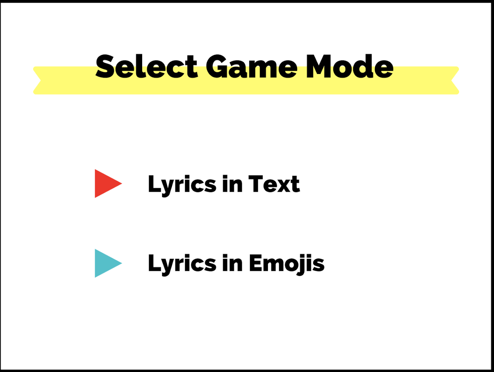
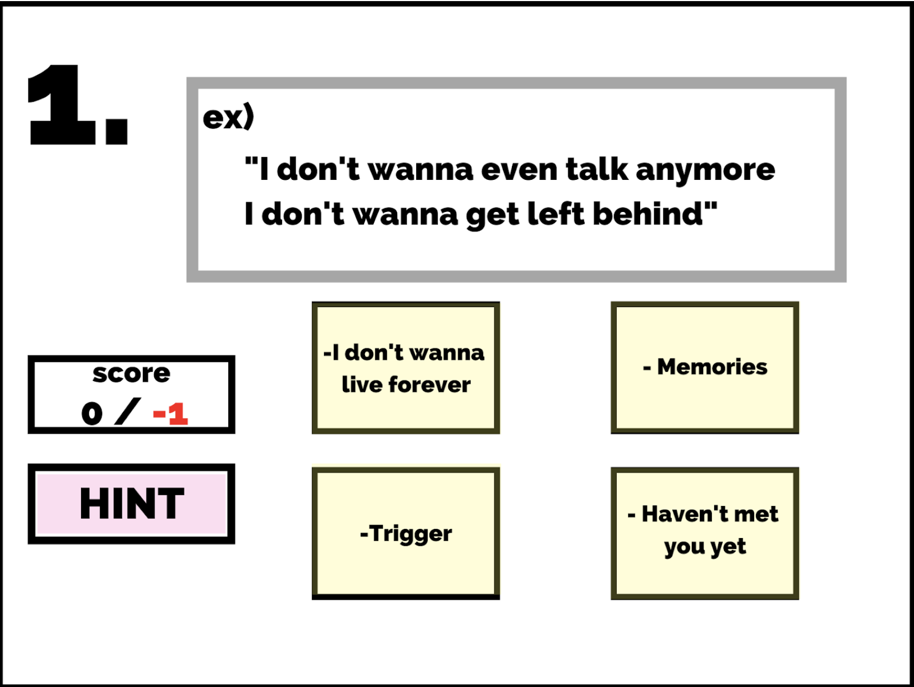

## Midterm Project - Making a Game ##

My brief idea: Making a game where you have to guess the title of the song by its lyrics
- The users can select the level of difficulty 
  - Just lyric in text version
  - Lyrics in emoji version

↑ This is the starting page 

↑ This is the page where you can select your game mode (choosing between text-only or emoji ver)

↑ This is the demo page for text-only version

↑ This is the demo page for emoji version

### However... ###

I decided to change my game...
into "Burger Stack"

The basic idea is similar to the game "Sky Burger" where you stack the falling ingredients.

However, I decided to change the game into a more dynamic version.

- The lower bread moves according to the mouse
- The customer demands certain type of burger randomly (ex. 2 patties, 3 lettuce, 1 cheese, ...)
  - This will show at the top right (or left)
- The player has to catch the falling ingredients according to the customer's demand
- If the stacked burger is same as the customer's needs, the player gains a point.
- If the player successfully makes the burger 10 times, the game ends (player wins)
- If the player gets three times wrong, he/she looses the game.

This is the demo icon of the falling ingredients found in the internet

